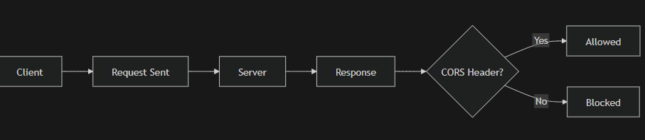
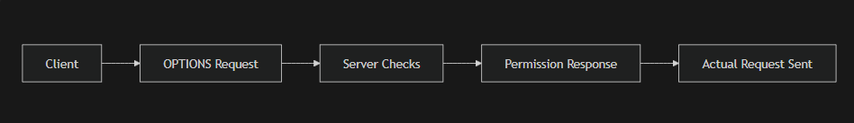

# 🌐 Complete HTTP Guide (From Basics to Advanced)

> A fully detailed guide covering HTTP methods, headers, CORS, caching, compression, and security.

---

# 📌 1. HTTP Headers

HTTP headers are **metadata** sent between client and server.

## 🔹 Types of Headers

| Type              | Description |
|------------------|------------|
| Request Headers  | Sent by client (e.g., Authorization, Origin) |
| Response Headers | Sent by server (e.g., Content-Type) |
| General Headers  | Used in both |
| Entity Headers   | Describe body (e.g., Content-Length) |

---

# 📌 2. HTTP Methods

## 🔹 Methods Overview

| Method | Purpose | Idempotent |
|--------|--------|-----------|
| GET    | Fetch data | ✅ Yes |
| POST   | Create new resource | ❌ No |
| PUT    | Replace entire resource | ✅ Yes |
| PATCH  | Update partial data | ❌ No |
| DELETE | Remove resource | ✅ Yes |

---

## 🔹 Idempotent vs Non-Idempotent

- **Idempotent** → Repeating request gives same result  
- **Non-idempotent** → Repeating changes result  

---

# 📌 3. CORS (Cross-Origin Resource Sharing)

## 🔹 What is CORS?

CORS controls whether a frontend from one origin can access a backend from another.

---

## 🔹 Why CORS Error Occurs?

CORS error happens when:
- Server does NOT allow your origin
- Missing headers:

Access-Control-Allow-Origin

---

# 📌 4. SIMPLE REQUEST FLOW (IMAGE EXPLANATION)

## 🖼 Image Explanation (Page 1 - Simple Flow)

The image shows:

- Left side: `example.com` (frontend)
- Right side: `api.example.com` (backend)

### 🔹 Request Sent:

GET /api/products/123 HTTP/1.1
Host: api.anotherdomain.com
Origin: https://example.com

Accept: application/json

### 🔹 Server Response WITHOUT CORS:

HTTP/1.1 200 OK
Content-Type: application/json

➡ Browser blocks this response ❌

---

### 🔹 Server Response WITH CORS:

HTTP/1.1 200 OK
Content-Type: application/json
Access-Control-Allow-Origin: https://example.com

➡ Browser allows response ✅

---

## 🔄 Flowchart

# 📌 5. PREFLIGHT REQUEST (IMAGE EXPLANATION)

## 🖼 Image Explanation (Page 1 - Preflight)

A **preflight request** is automatically sent by the browser before the actual request when it detects a potentially unsafe or complex request.

### 🔹 When is it triggered?

A preflight request occurs when:

- HTTP Method is:
  - `PUT`
  - `PATCH`
  - `DELETE`
- OR request includes **custom headers**:
  - `Authorization`
- OR request uses **complex Content-Type**:
  - `application/json` (non-simple)
  - anything other than:
    - `text/plain`
    - `application/x-www-form-urlencoded`
    - `multipart/form-data`

---

### 🔹 Conditions Shown in the Image

- Method is NOT `GET`, `POST`, or `HEAD`
- Custom headers are present
- Content-Type is non-simple

---

## 🔄 Preflight Flowchart

## 📌 6. The OPTIONS Method & CORS (Preflight)

### 🔹 What is the OPTIONS Method?
The `OPTIONS` method is a **safe** and **idempotent** HTTP method used to query a server about the communication options available for a target resource. It does not modify data; it asks for "permission" or "capabilities."

### 🔹 Understanding CORS (Cross-Origin Resource Sharing)
**Definition:** A security mechanism implemented by browsers that restricts web pages from making requests to a different domain than the one that served the web page.

#### ❌ How a CORS Error Occurs:
1.  **Different Origin:** Your frontend is at `http://localhost:3000` and your API is at `http://api.example.com`.
2.  **SOP (Same-Origin Policy):** The browser blocks the response because the server didn't explicitly "invite" the frontend's domain.
3.  **Missing Headers:** The server failed to send the `Access-Control-Allow-Origin` header.

#### ✅ How to Fix CORS:
On the server side, you must include these headers in the response:
* `Access-Control-Allow-Origin: https://frontend.com`
* `Access-Control-Allow-Methods: GET, POST, PUT, DELETE, OPTIONS`
* `Access-Control-Allow-Headers: Content-Type, Authorization`

### 🔹 The Preflight Flowchart

---

## 📌 7. Detailed HTTP Status Codes
Status codes tell the client exactly what happened on the server.

### 🔹 Class Breakdown
| Range | Category | Description |
| :--- | :--- | :--- |
| **1xx** | **Informational** | Request received, continuing process (e.g., 101 Switching Protocols for WebSockets). |
| **2xx** | **Success** | The action was successfully received, understood, and accepted. |
| **3xx** | **Redirection** | Further action must be taken in order to complete the request. |
| **4xx** | **Client Error** | The request contains bad syntax or cannot be fulfilled (The user's fault). |
| **5xx** | **Server Error** | The server failed to fulfill an apparently valid request (The developer's fault). |

### 🔹 Comprehensive Status Code Table
| Code | Full Form / Name | Detailed Explanation |
| :--- | :--- | :--- |
| **200** | **OK** | Standard success for GET/POST. |
| **201** | **Created** | Success; a new resource was created (e.g., a new user). |
| **204** | **No Content** | Success, but the server is sending no data back (common for OPTIONS/DELETE). |
| **301** | **Moved Permanently** | This URL is old; go to the new one provided in the `Location` header. |
| **304** | **Not Modified** | Use your cached version; the data hasn't changed. |
| **400** | **Bad Request** | The server cannot process the request due to client error (wrong JSON format). |
| **401** | **Unauthorized** | You are not logged in. Authentication is required. |
| **403** | **Forbidden** | You are logged in, but you don't have permission to see this. |
| **404** | **Not Found** | The resource does not exist on this server. |
| **429** | **Too Many Requests** | Rate limiting; you are sending requests too fast. |
| **500** | **Internal Server Error** | The server's code crashed. |
| **502** | **Bad Gateway** | The server (proxy) got an invalid response from the backend. |
| **503** | **Service Unavailable** | Server is down for maintenance or overloaded. |

---

## 📌 8. Caching & ETag (Efficiency)

### 🔹 ETag (Entity Tag)
An ETag is a unique string (hash) representing a specific version of a file.
1.  **First Request:** Server sends data + `ETag: "v1"`.
2.  **Second Request:** Browser sends `If-None-Match: "v1"`.
3.  **Check:** If the file hasn't changed, the server sends **304 Not Modified**. No data is re-downloaded, saving time.

---

## 📌 9. Content Negotiation & Compression

### 🔹 Content Negotiation
The server chooses the best response based on client-provided headers:
* **Accept:** `application/json` vs `text/html`.
* **Accept-Language:** `en-US` vs `hi-IN`.
* **Accept-Encoding:** Client's supported compression (gzip, br).

### 🔹 Compression Types
* **Gzip:** Standard, fast, and widely supported.
* **Brotli (br):** Modern, higher compression ratio (best for text/JS/CSS).

---

## 📌 10. Persistent Connections (Keep-Alive)

In **HTTP/1.0**, every request required a new TCP handshake (expensive).
In **HTTP/1.1+**, the `Connection: keep-alive` header keeps the connection open, allowing multiple requests to use the same "pipe."

---

## 📌 11. Security (SSL/TLS & HTTPS)

* **SSL:** Secure Sockets Layer (Old version).
* **TLS:** Transport Layer Security (Modern, secure version).
* **HTTPS:** HTTP + TLS. It ensures **Encryption** (privacy), **Integrity** (no tampering), and **Authentication** (identity proof).

---

## 📌 12. Advanced Data Handling

### 🔹 Multipart Requests
Used for file uploads. The body uses a `boundary` to separate text fields from binary file data.
`Content-Type: multipart/form-data; boundary=---WebkitBoundary`

### 🔹 Streaming Responses
The server sends data in chunks (`Transfer-Encoding: chunked`). This is vital for:
* Video/Audio streaming.
* Large PDF generation.
* Real-time data feeds.

---

## 📌 13. Burp Suite (Security Testing)
**Full Form:** PortSwigger Burp Suite.
It acts as a **Proxy** between your browser and the server.
* **Intercept:** Pause a request to see/edit headers/body.
* **Repeater:** Manually resend a modified request multiple times to test API logic.
* **Intruder:** Automate attacks (like password guessing or fuzzing).